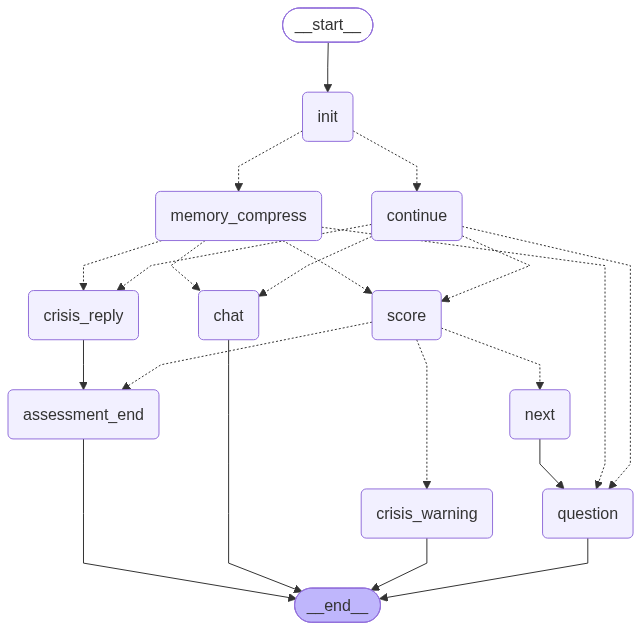

# 心理健康评估 Agent（PHQ-9）

基于 **LangGraph + DeepSeek** 构建的多轮心理健康评估 Agent，实现 PHQ-9 九题完整评估流程、自动打分、危机干预与自由对话，具备 SQLite 会话持久化能力。

---

## ✨ 项目亮点

- **完整 PHQ-9 流程**：自动逐题提问 → LLM 语义打分（0-3分）→ 汇总结果 → 进入自由对话，主流程已完整跑通
- **危机干预路径**：第9题（自杀倾向）得分 ≥ 1 时自动触发独立危机预警节点，转入专项疏导对话
- **有状态多轮架构**：11 字段 `AgentState` + 自定义 Reducer，通过 `waiting` / `phase` 双字段精确控制节点路由，采用 per-turn re-invoke 而非 interrupt 模式
- **会话持久化**：`SqliteSaver` 存储完整对话历史，支持断点续测；超 30 轮自动触发 LLM 压缩长期记忆摘要
- **工程化 Prompt**：打分节点、危机回复节点均使用独立设计的 System Prompt，保证结构化输出

---

## 🏗 架构图



> 图为 LangGraph 自动生成的节点路由图，完整展示 init → question → score → crisis_warning / assessment_end → chat 的路由逻辑。

---

## 📁 项目结构

```
mental-health-agent/
├── 1graph.py                # 主程序：完整 LangGraph PHQ-9 Agent
├── mental_health_graph.png  # LangGraph 自动生成的状态路由图
├── requirements.txt         # 精确版本依赖（pip freeze）
├── 1hello_deepseek.py       # [Day 1-15] DeepSeek API 连通验证
├── 2chat_with_memory.py     # [Day 1-15] 多轮对话 + 记忆管理
├── 3phq9_agent.py           # [Day 1-15] LangChain 版 PHQ-9（LangGraph 前）
├── 4app.py                  # [Day 1-15] Gradio 界面实验
├── 6persisitent.py          # [Day 1-15] 早期持久化实验
├── data/                    # SQLite 数据库目录（首次运行自动创建）
├── docs/                    # 项目文档与开发日志
└── research-materials/      # 系统综述相关资料
```

> 编号文件记录了从 DeepSeek API 调用到 LangGraph Agent 的完整开发演进，Day 20 起切换至 LangGraph 架构，`1graph.py` 为当前主程序。

---

## 🚀 快速开始

### 1. 克隆仓库 & 创建环境

```bash
git clone https://github.com/xyq-bit/mental-health-agent.git
cd mental-health-agent

conda create -n mental_agent python=3.11
conda activate mental_agent
pip install -r requirements.txt
```

### 2. 配置 API Key

在项目根目录新建 `.env` 文件，写入：

```
OPENAI_API_KEY=sk-你的DeepSeek密钥
```

> DeepSeek API 申请地址：https://platform.deepseek.com

### 3. 创建数据目录

```bash
mkdir data
```

`SqliteSaver` 会在 `data/` 目录下自动生成数据库文件，但不会自动创建目录，**跳过此步会报错**。

### 4. 运行评估 Agent

```bash
python 1graph.py
```

启动后会自动开始 PHQ-9 第 1 题，按提示输入回答即可。

---

## 🔄 对话流程

```
用户启动
   ↓
[init] 新用户初始化 / 老用户直接进入
   ↓
[question] 逐题提问（第 1-9 题）
   ↓
[score] LLM 语义打分（0=完全没有 / 1=有几天 / 2=超过一半 / 3=几乎每天）
   ↓
第 9 题得分 ≥ 1 → [crisis_warning] → [crisis_reply] → [assessment_end]
第 9 题得分 = 0 且 q_idx ≥ 9 → [assessment_end]
   ↓
[chat] 基于测评结果的自由对话（含长期记忆摘要）
```

---

## 🛠 技术栈

| 模块 | 技术 |
|---|---|
| Agent 框架 | LangGraph 0.2.x（StateGraph + 条件路由） |
| LLM | DeepSeek-Chat / DeepSeek-V3（via OpenAI SDK） |
| 持久化 | SqliteSaver（LangGraph 官方 checkpoint） |
| 状态管理 | TypedDict + Annotated Reducer |
| 环境管理 | Conda + python-dotenv |

---

## 📊 AgentState 字段说明

| 字段 | 类型 | 说明 |
|---|---|---|
| `username` | str | 用户标识（作为 thread_id） |
| `phase` | int | 当前阶段（0=登录 1=测评 2=危机 3=自由对话） |
| `waiting` | bool | False=该问新题，True=等待用户回答/打分 |
| `q_idx` | int | 当前题号（1-9） |
| `total_score` | int | PHQ-9 累计得分 |
| `q9_score` | int | 第9题单独分数（触发危机判断） |
| `crisis_flag` | bool | 危机预警标志 |
| `messages` | List[dict] | 对话历史（自定义 Reducer 追加） |
| `assessment_result` | str | 最终测评结论 |
| `long_term_summary` | str | LLM 生成的长期记忆摘要 |

---

## ⚙️ 关键设计决策

**为什么用 per-turn re-invoke 而不是 interrupt？**
每次用户输入都重新 invoke 整个图，通过 `waiting` 字段区分"该问题"还是"该打分"，配合 `SqliteSaver` checkpoint 恢复状态。相比 interrupt 模式，更适合 CLI 环境，也更易于调试。

**LLM 打分失败怎么处理？**
`node_score` 在 LLM 调用失败或返回值无法解析时均 `raise RuntimeError`，由外层 `try/except` 捕获后提示用户重试。不默认 0 分，避免产生科学上无效的测评结果。

---

## 🗺 后续规划

- [ ] MediaPipe 实时表情识别接入（情绪辅助评估）
- [ ] Gradio / FastAPI Web 界面
- [ ] GAD-7 焦虑量表模块
- [ ] RAG 接入心理健康知识库

---

## 📄 License

MIT © 2025 xyq-bit